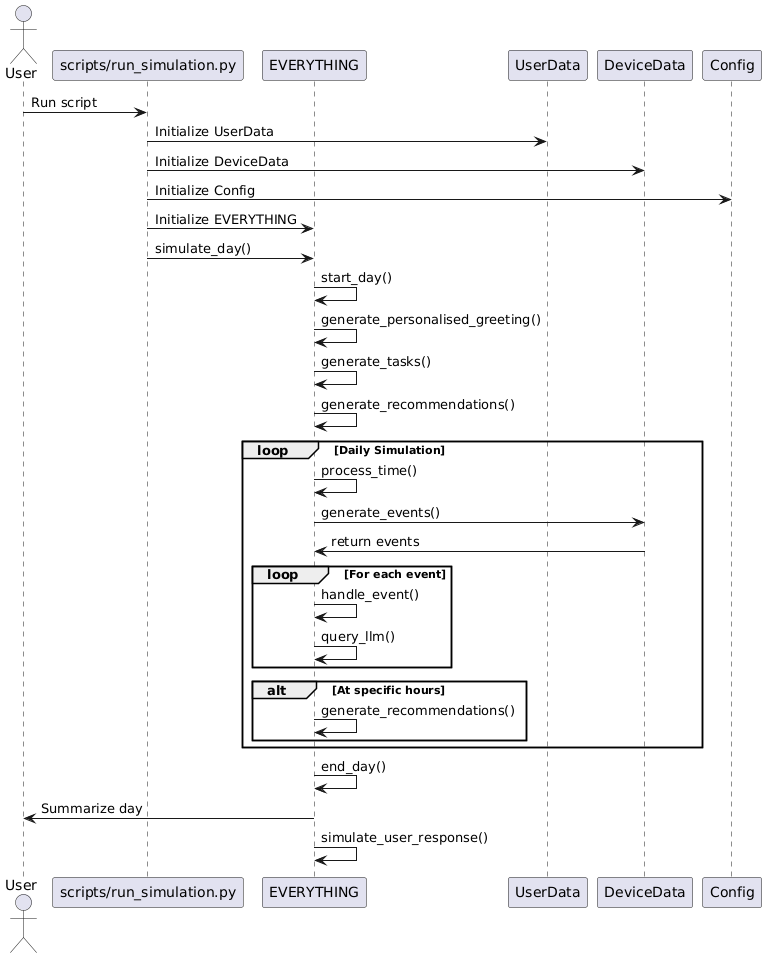

# EVERYTHING

**EVERYTHING** is a an advanced agent, proactively managing users' daily lives by providing personalized recommendations and automating tasks based on their preferences and context.


_This system is heavily built upon LLMs, and we refrain from using the term **AI** in our branding (ex: EVERYTHING AI) because we believe that finding an effective solution to the problem is more important than the means by which it is achieved._


## Features

1. **User Interaction Management**:
   - Generates personalised greetings based on user data.
   - Handles events and generates proactive actions.
   - Simulates a day in the user's life with various interactions and recommendations.

2. **Task and Recommendation Generation**:
   - Generates proactive tasks for the user based on their profile and calendar.
   - Generates personalised recommendations considering user profile, social media, music preferences, current location, and time of day.

3. **Event Management**:
   - Generates events based on the user's location and upcoming events.
   - Handles notifications for upcoming events and suggests proactive actions.

4. **Integration with External APIs**:
   - Uses OpenAI API for generating personalised content and responses.
   - Loads environment variables for API keys and configuration.

5. **Logging and Error Handling**:
   - Logs various activities and notifications.
   - Handles errors from the OpenAI API gracefully.

6. **Simulation of User Responses**:
   - Simulates user responses to the AI assistant's prompts.

7. **Configuration Management**:
   - Loads configuration settings from environment variables and configuration files.

8. **Data Management**:
   - Manages user-related data and profiles.
   - Handles device-related data and event generation.

9. **Docker Support**:
   - Provides Docker support for running the application in a containerised environment.

10. **Testing**:
    - Includes unit tests for various modules and functionalities.

# Assumptions Made

1. User Profile: The user profile is largely static, defined in a JSON adn CSV files. A more realistic AI agent would continuously update and learn from user behavior and preferences.

2. Decision Making: The decision-making process is primarily based on predefined rules and simple LLM queries. A more sophisticated AI would use complex machine learning models for decision making, considering numerous factors and historical data.

3. Recommendation System: The recommendation system is relatively simple, generating recommendations at fixed intervals. A more advanced system would use more complex algorithms, considering real-time data (From Weather APIs, Traffic APIs, etc.) and user feedback.


## Project Structure

- `everything/`: Contains the main AI logic and configuration.
- `user_data/`: Manages user-related data and profiles.
- `device_data/`: Handles device-related data and event generation.
- `scripts/`: Contains scripts for running the simulation.
- `requirements.txt`: Lists the required Python packages.


## Sequence Diagram




## Requirements

- Python 3.7 or higher
- OpenAI API key

## Installation

1. Clone the repository:
   ```
   git clone https://github.com/usamahz/everything.git
   cd everything
   ```

2. Create a virtual environment and activate it:
   ```
   python -m venv venv
   source venv/bin/activate  # On Windows, use `venv\Scripts\activate`
   ```

3. Install the required packages:
   ```
   pip install -r requirements.txt
   ```

4. Set up your OpenAI API key:
   Create a `.env` file in the root directory and add your OpenAI API key:
   ```
   OPENAI_API_KEY=your_api_key_here
   ```

## Usage

Run the simulation:
    ```
    python scripts/run_simulation.py  
    ```

Run in Docker:
    ```
    docker-compose up --build
    ```

## Further Work Notes

### 1. Implement RAG
- **Why**: RAG combines the strengths of retrieval-based and generative models, allowing for more accurate and contextually relevant responses. It enhances the model's ability to provide information by retrieving relevant documents from a knowledge base, which can improve the quality of generated text.
- **How**:
  - Perform lightweight retrieval on-device.
  - Offload complex generation tasks to server when necessary.
  - Sync knowledge base incrementally to balance freshness and data usage.
- **Tools/Libraries**:
  - **LangChain**: For building applications that integrate LLMs with external data sources.
  - **LlamaIndex**: For managing and querying large datasets efficiently.
  - **Haystack**: For building search systems that can retrieve documents and generate responses.

### 2. Make it Scalable
- **How**:
  - **Server-side Processing**: Run larger models on cloud infrastructure, using APIs for mobile communication.
  - **On-device Optimization**: Use quantization and pruning to run smaller models directly on mobile devices.
  - **Hybrid Approach**: Combine on-device inference for quick tasks with server-side processing for complex operations.

### 3. Fast Inference
- **Why**: Fast inference is crucial for user experience, especially in real-time applications. Reducing latency ensures that users receive responses quickly, which is essential for maintaining engagement and satisfaction.
- **Tools/Libraries**:
  - **ONNX Runtime**: For optimizing and running models efficiently.
  - **TensorFlow Lite**: For on-device machine learning on mobile and edge devices.
  - **ML Kit**: For easy-to-use machine learning functionality on Android.
  - **Quantization Libraries**: Such as **Hugging Face's Transformers** for model compression techniques to speed up inference.
  - **Groq**: For leveraging specialized hardware designed for fast inference tasks.
